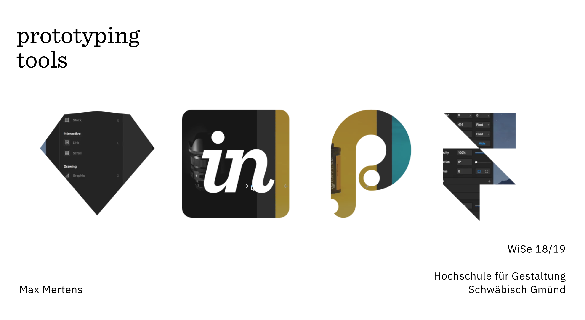

## 01 Sketch

#### Inspiration
- [Dribbble](https://dribbble.com/)  
- [Pinterest](https://www.pinterest.com/)  
- [Behance](https://www.behance.net/)    
- [Designinspiration](https://www.designspiration.net/)  
- [Arena](https://www.are.na/)

#### Tools & Resources
- [Facebook Design Resources](https://facebook.design/toolsandresources/)  → Device images, GUI libraries and Kits 
- [Unsplash](https://unsplash.com/)  → Beautiful, free photos.
- [Khroma](http://khroma.co/)  → AI color tool for designers.
- [The Noun Project](https://thenounproject.com/)  → Over 1 Million royalty–free icons
- [Onym](https://onym.co/) → Tools and resources for naming things.
- [VanSchneider Colors](https://www.vanschneider.com/colors) → Unique color combinations.
- [Laws of UX](https://lawsofux.com/) → Collection of maxims and principles for building user interfaces.

#### Plug-ins
- [Sketch Runner](https://sketchrunner.com/)  
- [Craft](https://www.invisionapp.com/craft)  
- [Map Generator](https://github.com/eddiesigner/sketch-map-generator)
- [Align To](https://github.com/LucienLee/AlignTo)
- [Content Generator](https://github.com/timuric/Content-generator-sketch-plugin)

#### Tutorials
- [Sketch Together](https://www.youtube.com/watch?v=cEplnCnZuDM&list=PLWlUJU11tp4fEXI8deWhBQAHDv9R23WHB)

## 02 Invision
## 03 Principle
## 04 Framer X
